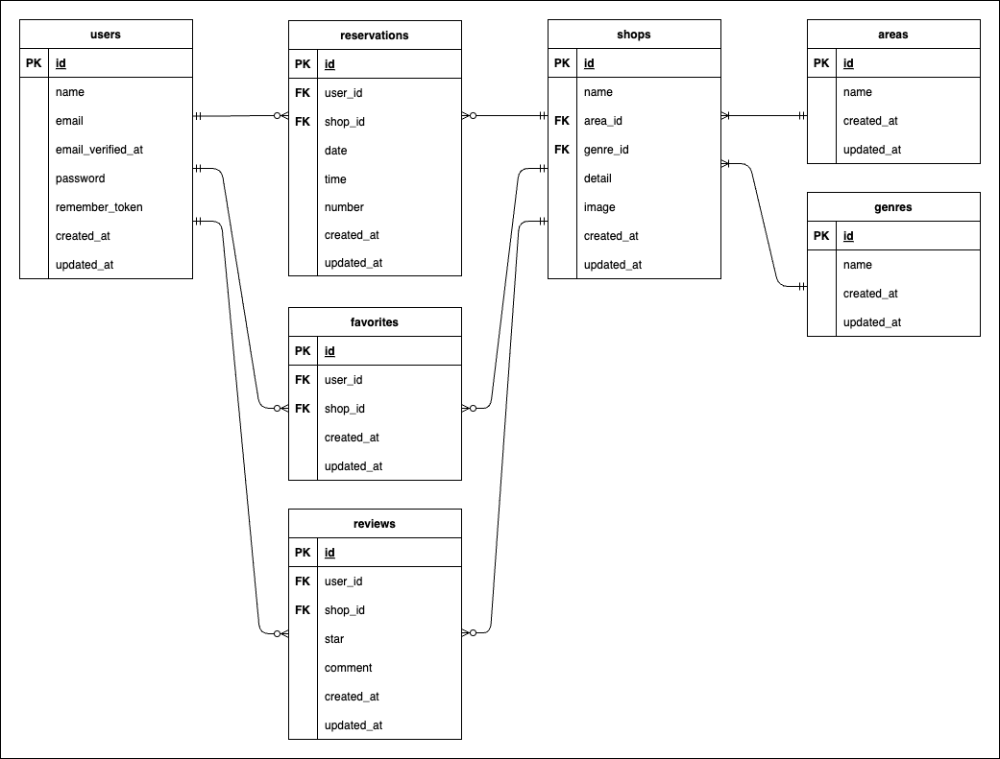

# rese(飲食店予約サービス)

日本各地の飲食店情報を掲載し、お店探しやネット予約などのサービスをご利用いただけます。


## 作成した目的

ある企業のグループ会社が自社の飲食店予約サービスを持つため。

## 機能一覧

- 会員登録機能
- ログイン機能
- ログアウト機能
- メール認証機能
- ユーザー情報取得
- ユーザー飲食店予約情報取得
- ユーザー飲食店お気に入り一覧取得
- 飲食店一覧取得
- 飲食店詳細取得
- 飲食店予約情報追加機能
- 飲食店予約情報削除機能
- 飲食店予約情報変更機能
- 飲食店お気に入り追加機能
- 飲食店お気に入り削除機能
- 飲食店評価機能
- 飲食店エリア検索機能
- 飲食店ジャンル検索機能
- 飲食店キーワード検索機能
- QR コード表示機能(備考:QR コードの内容は各飲食店の詳細情報。)
- リマインダー機能(備考:予約情報の通知はメール形式。コマンド入力による手動での実行ならばメールの送信は可能。自動送信は不可。)
- 決済機能(備考:決済画面の立ち上げのみ。決済の実行は不可。)

## 使用技術(実行環境)

- PHP 7.4.9
- Laravel 8.83.27
- MySQL 8.0.26
- Docker 4.35.1

## 環境構築

**Docker ビルド**

1. ディレクトリの作成

カレントディレクトリから以下のようなディレクトリ構成を作成します。

```
rese
├── docker
│ ├── mysql
│ │ ├── data
│ │ └── my.cnf
│ ├── nginx
│ │ └── default.conf
│ └── php
│ ├── Dockerfile
│ └── php.ini
├── docker-compose.yml
└── src
```

```
$ mkdir rese
$ cd rese
$ mkdir docker src
$ touch docker-compose.yml
$ cd docker
$ mkdir mysql nginx php
$ mkdir mysql/data
$ touch mysql/my.cnf
$ touch nginx/default.conf
$ touch php/Dockerfile
$ touch php/php.ini
$ cd ../
$ tree .
```

2. docker-compose.yml の作成

docker-compose.yml に以下の内容を追加します。

```
version: '3.8'

services:
    nginx:
        image: nginx:1.21.1
        ports:
            - "80:80"
        volumes:
            - ./docker/nginx/default.conf:/etc/nginx/conf.d/default.conf
            - ./src:/var/www/
        depends_on:
            - php

    php:
        build: ./docker/php
        volumes:
            - ./src:/var/www/

    mysql:
        image: mysql:8.0.26
        environment:
            MYSQL_ROOT_PASSWORD: root
            MYSQL_DATABASE: laravel_db
            MYSQL_USER: laravel_user
            MYSQL_PASSWORD: laravel_pass
        command:
            mysqld --default-authentication-plugin=mysql_native_password
        volumes:
            - ./docker/mysql/data:/var/lib/mysql
            - ./docker/mysql/my.cnf:/etc/mysql/conf.d/my.cnf

    phpmyadmin:
        image: phpmyadmin/phpmyadmin
        environment:
            - PMA_ARBITRARY=1
            - PMA_HOST=mysql
            - PMA_USER=laravel_user
            - PMA_PASSWORD=laravel_pass
        depends_on:
            - mysql
        ports:
            - 8080:80
```

3. Nginx の設定

./docker/nginx/default.conf に以下の内容を追加します。

```
server {
    listen 80;
    index index.php index.html;
    server_name localhost;

    root /var/www/public;

    location / {
        try_files $uri $uri/ /index.php$is_args$args;
    }

    location ~ \.php$ {
        fastcgi_split_path_info ^(.+\.php)(/.+)$;
        fastcgi_pass php:9000;
        fastcgi_index index.php;
        include fastcgi_params;
        fastcgi_param SCRIPT_FILENAME $document_root$fastcgi_script_name;
        fastcgi_param PATH_INFO $fastcgi_path_info;
    }
}
```

4. PHP の設定

./docker/php/Dockerfile に以下の内容を追加します。

```
FROM php:7.4.9-fpm

COPY php.ini /usr/local/etc/php/

RUN apt update \
  && apt install -y default-mysql-client zlib1g-dev libzip-dev unzip \
  && docker-php-ext-install pdo_mysql zip

RUN curl -sS https://getcomposer.org/installer | php \
  && mv composer.phar /usr/local/bin/composer \
  && composer self-update

WORKDIR /var/www
```

./docker/php/php.ini に以下の内容を追加します。

```
date.timezone = "Asia/Tokyo"

[mbstring]
mbstring.internal_encoding = "UTF-8"
mbstring.language = "Japanese"
```

5. MySQL の設定

./docker/mysql/my.conf に以下の内容を追加します。

```
[mysqld]
character-set-server = utf8mb4

collation-server = utf8mb4_unicode_ci

default-time-zone = 'Asia/Tokyo'
```

6. DockerDesktop アプリを立ち上げる
7. docker-compose コマンドで開発環境を構築する

```
docker-compose up -d --build
```

**Laravel 環境構築**

1. PHP コンテナにログイン

コマンドライン上で以下の docker-compose コマンドを実行し、PHP コンテナにログインします。

```
docker-compose exec php bash
```

2. Composer がインストールされているか確認する

PHP コンテナ内で以下の composer コマンドを実行し、Composer がインストールされているか確認します。

```
composer -v
```

3. Laravel のプロジェクトを作成

PHP コンテナ内で以下の composer コマンドを実行し、Laravel のプロジェクトを作成します。

```
composer create-project "laravel/laravel=8.*" . --prefer-dist
```

4. 時間設定の編集

./src/config/app.php を以下のように修正します。

修正前

```
'timezone' => 'UTC',
```

修正後

```
'timezone' => 'Asia/Tokyo',
```

5. マイグレーションの実行

```bash
php artisan migrate
```

6. シーディングの実行

```bash
php artisan db:seed
```

## ER 図



## パッケージのインストール

1. simple-qrcode のインストール

./docker/php/Dockerfile に以下の内容を追加します。

```
RUN apt-get update && apt-get install -y \
  libfreetype6-dev \
  libjpeg62-turbo-dev \
  libpng-dev \
  && docker-php-ext-configure gd --with-freetype --with-jpeg \
  && docker-php-ext-install -j$(nproc) gd
```

PHP コンテナ内で以下の composer コマンドを実行し、simple-qrcode をインストールします。

```
composer require simplesoftwareio/simple-qrcode
```

2. Laravel Cashier のインストール

PHP コンテナ内で以下の composer コマンドを実行し、Laravel Cashier をインストールします。

```
composer require laravel/cashier
```

## URL

- 開発環境：http://localhost/
- phpMyAdmin：http://localhost:8080/
